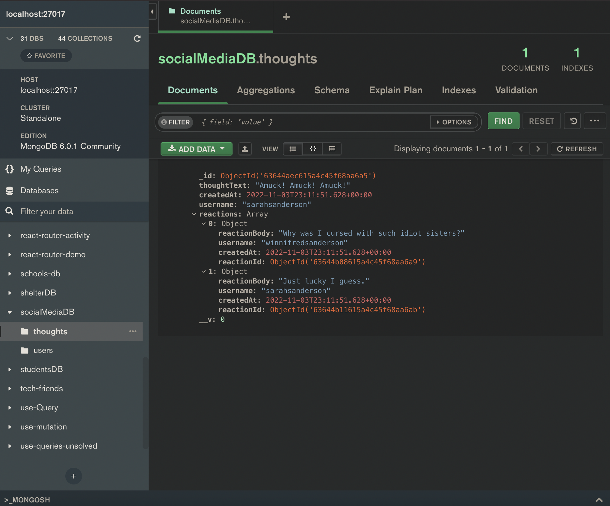

# Social Network API

## Description

---

This is a backend MongoDB database and Express JS server that can track users along with their thoughts and reactions to thoughts. The database also tracks friend lists.

## Table of Contents

---

1. [Installation](#installation)
1. [Usage Recommendations](#usage)
1. [Questions?](#questions)

## Installation

---

Clone the repository data to your local device. To start the server, run `npm run start` in the terminal. To seed user data, run `npm run seed`.

## Usage Recommendations

---

This API can be integrated with your front end code to support social media functionality on your site.

To see the API in action, check out this [demonstration video](https://watch.screencastify.com/v/QbaorDThnNm9PePTZ6AJ).

## Questions?

---

- Email: [relero90@gmail.com](relero90@gmail.com)
- GitHub: [relero90](https://github.com/relero90)
